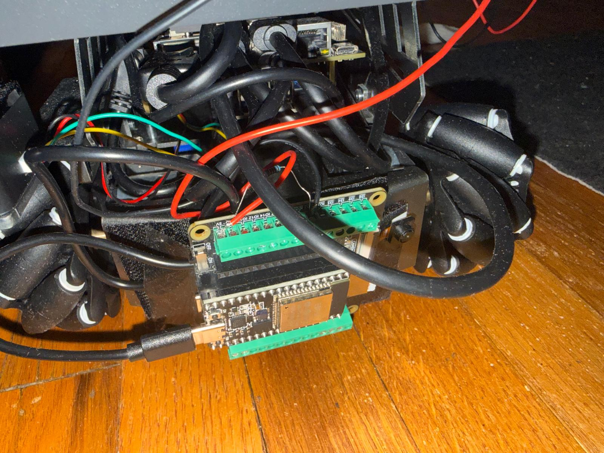
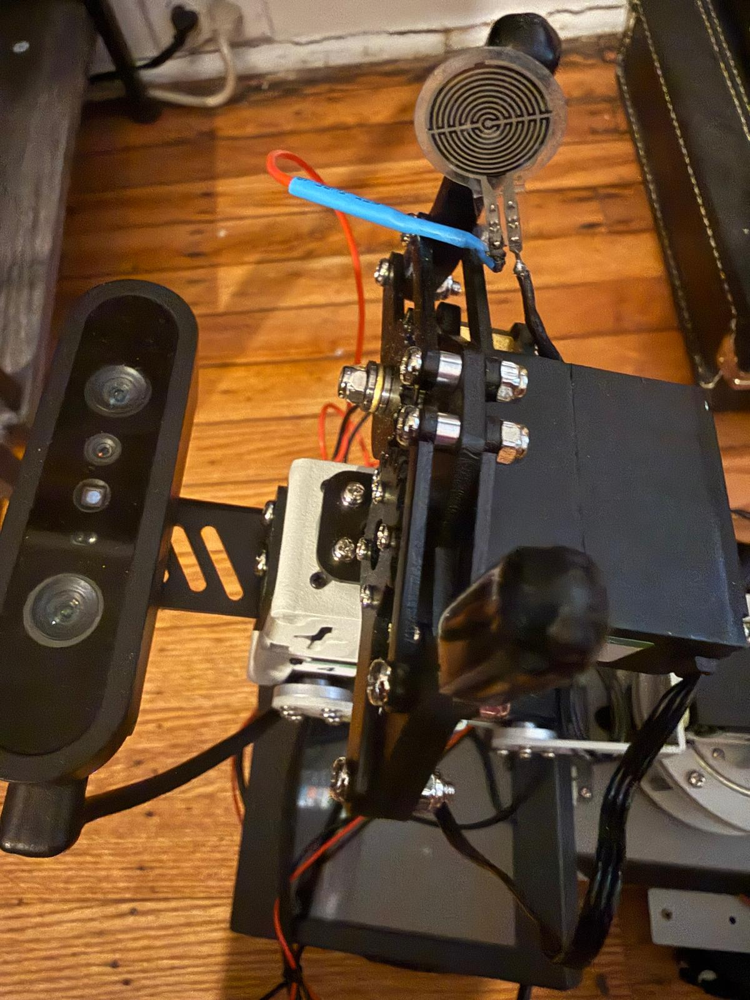
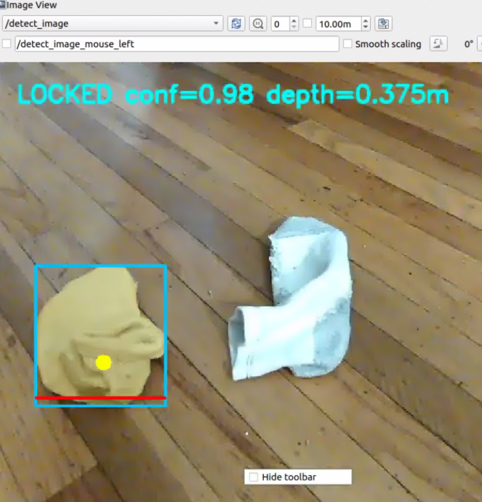
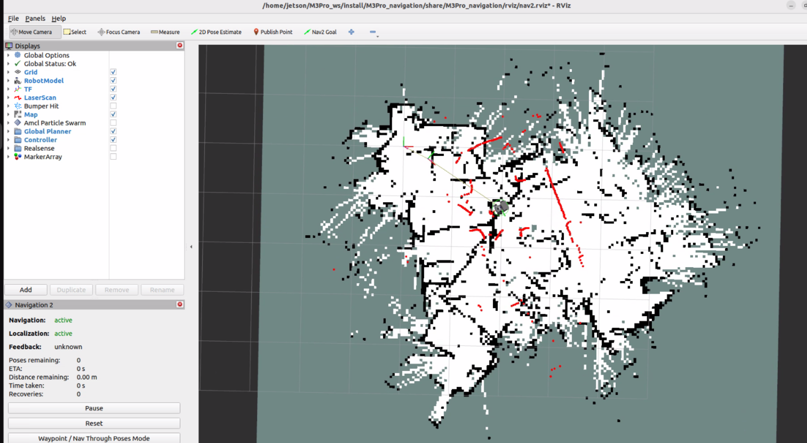

# Sock-Handling Robot

An autonomous mobile robotics project built on the **Yahboom M3Pro** platform with a robotic arm, computer vision, and ROS 2. The goal of this project is to enable the robot to **search for socks, approach them, grasp them from the floor, and hand them off to a person**, while coordinating navigation, perception, arm control, and sensor feedback in a full end-to-end workflow.

---

## Project Overview

This project combines:

- **ROS 2 Humble**
- **Yahboom M3Pro mobile robot**
- **6-DOF robotic arm with gripper**
- **Computer vision with YOLO / TensorRT**
- **Inverse kinematics for grasping**
- **Force-sensor feedback for grasp verification**
- **Navigation and patrol behaviors**
- **Person detection for handoff after pickup**

The system was designed to go beyond simple object detection by integrating **mobile base movement, visual target acquisition, grasp execution, recovery logic, and person delivery behavior** into a single robotics workflow.

---

## What the Robot Does

The robot is being developed to perform the following sequence:

1. **Patrol or scan an area** while searching for socks.
2. **Detect a sock** using a vision model.
3. **Lock onto the target** and keep it in view.
4. **Move closer with the mobile base** until the sock is in a reachable pickup range.
5. **Use arm inverse kinematics** to position the gripper over the sock.
6. **Touch the floor and grasp the sock** with the gripper.
7. **Verify the grasp** using a force sensor.
8. **Switch to person-finding behavior** after a successful pickup.
9. **Approach a person and hand off the sock**.
10. **Detect when the sock is removed** and resume the search cycle.

---

## Major Technical Work Completed

### 1. Vision-Based Sock Detection
I built and tested a sock-detection pipeline using **YOLO-based models**, including TensorRT acceleration for deployment on embedded hardware. This allowed the robot to detect socks efficiently and provide real-time targeting information for approach and pickup.

Key work included:

- Training and testing sock detection / segmentation models
- Deploying optimized TensorRT engines
- Publishing target information into ROS 2 topics
- Improving reliability of target selection during movement

---

### 2. Target Locking and Visual Tracking
To make pickup possible, I added logic so the robot could not only detect a sock once, but also **maintain a usable target while moving**. This included target locking and centroid-based targeting so the system could continue aligning even as the robot repositioned.

Key work included:

- Tracking the best sock target
- Computing a target centroid / grasp point
- Keeping the target in the camera view during approach
- Using image-space feedback to decide when the sock is close enough for the arm

---

### 3. Arm Inverse Kinematics Integration
A major part of the project was integrating the Yahboom arm kinematics service so the arm could move to computed grasp poses instead of relying on fixed hard-coded motions.

This included:

- Calling the arm kinematics service from ROS 2 nodes
- Converting camera observations into arm-reachable coordinates
- Testing grasp approach, touch, and lift phases
- Refining grasp offsets and arm orientation for floor pickup

A strong focus of this work was making the robot **actually touch the floor before closing the gripper**, rather than hovering and missing the sock.

---

### 4. Grasping Logic Improvements
I iterated on the sock pickup behavior to improve consistency and reduce failed grasps.

Important improvements included:

- Better pre-grasp and touch positioning
- Using the sock target more precisely instead of broad guesswork
- Adjusting approach offsets based on target placement
- Working toward grasping above the target center when needed
- Handling cases where the sock orientation changes pickup difficulty

This helped move the project from basic reach attempts toward **more realistic floor-level grasp execution**.

---

### 5. Force Sensor Integration
I added a force sensor workflow so the robot could determine whether it **actually secured the sock** instead of assuming success based only on arm motion.

This work included:

- Wiring and testing an **FSR402 force sensor**
- Connecting the sensor through an ESP32
- Monitoring live sensor readings over serial
- Publishing force data into ROS 2
- Using threshold logic to determine whether a grasp succeeded

This was an important step because it gave the robot **physical feedback**, not just visual confidence.

---

### 6. Handoff to a Person
After pickup, the robot transitions into a second behavior: **finding and delivering the sock to a person**.

This stage included:

- Switching from sock-focused behavior to person-targeting behavior
- Running person detection after a successful grasp
- Moving toward the person while maintaining a safe distance
- Detecting when the sock is removed from the gripper
- Returning back to patrol / search mode afterward

This turned the system into a more complete task pipeline rather than just a pickup demo.

---

### 7. Navigation, Patrol, and Mapping
I also worked on the navigation side of the robot so it could move through an environment and patrol instead of only reacting from a stationary position.

This work included:

- Setting up patrol behavior using Nav2
- Working with mapping and saved maps
- Testing localization and waypoint behavior
- Handling transitions between patrol, sock search, pickup, and handoff

This makes the robot more autonomous by combining **navigation and manipulation** in the same system.

---

## Software Architecture

The project is organized around several ROS 2 nodes that cooperate through topics and services.

Core responsibilities include:

- **Sock detection node** for visual perception
- **Target selection / centroid logic** for grasp targeting
- **IK pickup node** for arm approach and grasp execution
- **FSR sensor node** for grasp confirmation
- **Carry-to-person node** for handoff behavior
- **Patrol / navigation nodes** for map-based movement

This modular approach makes it easier to debug, test, and improve each subsystem independently.

---

## Hardware Used

- **Yahboom M3Pro mobile robot**
- **6-DOF robotic arm with gripper**
- **Depth / RGB camera**
- **Embedded compute for ROS 2 and inference**
- **ESP32 microcontroller**
- **FSR402 force sensor**
- Supporting power, wiring, and motor control hardware

---

## Key Challenges Solved

Some of the most important engineering problems addressed in this project were:

- Getting the robot to keep the sock in view while approaching
- Converting visual detections into usable grasp positions
- Making the arm touch the floor before grasping
- Distinguishing successful vs failed grasps with sensor feedback
- Switching behavior cleanly between search, pickup, and handoff
- Combining navigation, perception, and manipulation on one robot

---

## Photos

>







## Videos

> 

- [Pickup Attempt Demo](pickup_demo)](https://youtube.com/shorts/iOYxxX4nNP8?feature=share)
- [Handoff Demo](handoff_demo)

---

## Example Results

Current milestones achieved include:

- Detecting socks in real time
- Tracking and approaching the target
- Executing arm pickup attempts from floor level
- Using force feedback to evaluate grasp success
- Transitioning to person handoff logic after pickup
- Integrating patrol and autonomous behavior into the workflow

---

## Future Improvements

Planned next steps include:

- Increasing grasp reliability across more sock orientations
- Improving depth and target estimation near the floor
- Enhancing recovery behavior after missed grasps
- Expanding handoff robustness with better person-following logic
- Refining patrol and search coverage in larger mapped spaces
- Continuing to optimize onboard inference performance

---

## Why This Project Matters

This project demonstrates an applied robotics system that combines:

- **computer vision**
- **robot arm control**
- **sensor feedback**
- **mobile navigation**
- **behavior coordination**

Rather than solving only one subproblem, the work focuses on building a robot that can perform a meaningful real-world task from start to finish: **find a sock, pick it up, and bring it to a person**.

---

## Repository Contents

```bash
.
├── src/
├── launch/
├── models/
├── images/
└── README.md
